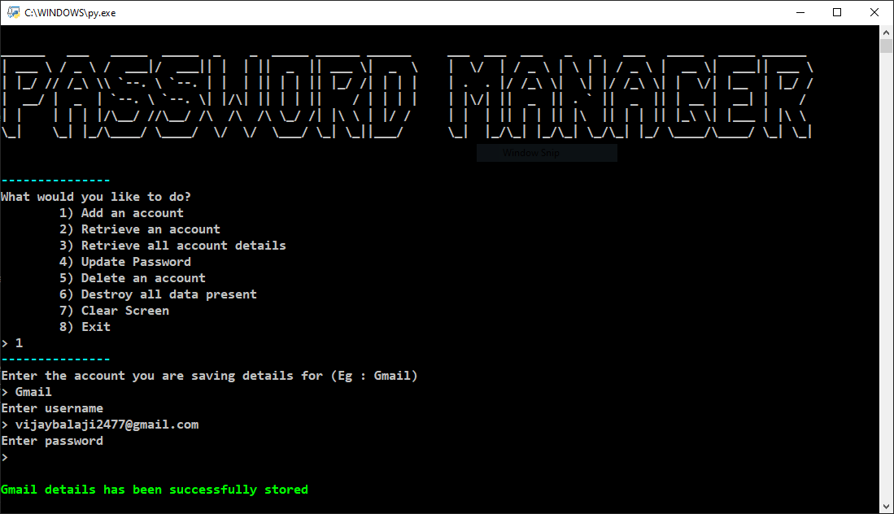

# Password-Manager

    
     A simple application built to keep your passwords safe and collected.

---

## Table of Contents

- [Motivation](#Motivation)
- [Installation](#Installation)
- [Usage](#Usage)
- [Disclaimer](#Disclaimer)
- [Contributing](#Contributing)
- [License](#License)

## Motivation

As the number of accounts created increases, it has become hard to collect and save all the passwords safely in one location. And hence I built this python application to create a database that keeps track of all your account usernames and passwords.

## Installation

**Prerequisites** : Python 3 and Cryptography module.

For the latest stable version, head to [Releases](https://github.com/SVijayB/Password-Manager/releases).

Download and extract the source code.

As an alternative, you could also clone the repository using,

<pre>
git clone https://github.com/SVijayB/Password-Manager.git
</pre>

Before running the application, you need to install the [cryptography](https://pypi.org/project/cryptography/) module. To do so, launch your terminal and type `pip install cryptography`. Once completed, you are ready to use the application.

You can also cd to the Password-Manager directory on your terminal and type 

<pre>
pip install -r requirements.txt
</pre>

## Usage

    

Run the `Password_manager.py` file present in the `src` folder.

You can do that by just double clicking on the file if you have the *python launcher* installed. Else, **`cd/`** to the **`src`** folder and type `python Password_manager.py`.

Once you have it running, follow the instructions given by the application.

You can use this along with the [Safe Haven](https://github.com/SVijayB/Safe-Haven) application for added security measures.

## Disclaimer

The use of the Password-Manager and its resources is **COMPLETE RESPONSIBILITY** of the **END-USER**. 
This application was created only to collect and save your passwords. It does not ensure the security of your passwords. The master key/password used to unlock the application should not be shared with anyone. The developers of this application are not responsible for loss or theft of data.

## Contributing 

To contribute to Password-Manager, fork the repository, create a new branch and send us a pull request. Make sure you read [CONTRIBUTING.md](https://github.com/SVijayB/Password-Manager/blob/master/.github/CONTRIBUTING.md) before sending us Pull requests. 

Also, thanks for contributing to Open-source!

## License 

Password-Manager is under The MIT License. Read the [LICENSE](https://github.com/SVijayB/Password-Manager/blob/master/LICENSE) file for more information.
